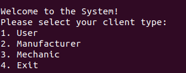
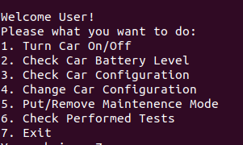
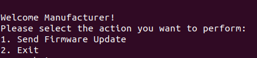
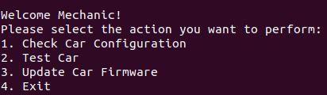

# T27 MotorIST

<!-- this is an instruction line; after you follow the instruction, delete the corresponding line. Do the same for all instruction lines! -->

## Team

| Number | Name              | User                             | E-mail                                            |
| -------|-------------------|----------------------------------| --------------------------------------------------|
| 102531 | Diana Goulão      | <https://github.com/Dianix21>    | <mailto:diana.goulao@tecnico.ulisboa.pt>          |
| 102702 | Mafalda Fernandes | <https://github.com/mafarrica>   | <mailto:mafalda.m.fernandes@tecnico.ulisboa.pt>   |
| 102710 | Miguel Sol        | <https://github.com/migueldsol>  | <mailto:migueldsol@tecnico.ulisboa.pt>            |
 

  


## Contents

This repository contains documentation and source code for the *Network and Computer Security (SIRS)* project.

The [REPORT](REPORT.md) document provides a detailed overview of the key technical decisions and various components of the implemented project.
It offers insights into the rationale behind these choices, the project's architecture, and the impact of these decisions on the overall functionality and performance of the system.

This document presents installation and demonstration instructions.

*(adapt all of the following to your project, changing to the specific Linux distributions, programming languages, libraries, etc)*

## Installation

To see the project in action, it is necessary to setup a virtual environment, with N networks and M machines.  

The following diagram shows the networks and machines:

*(include a text-based or an image-based diagram)*

### Prerequisites

All the virtual machines are based on: Linux 64-bit, Kali 2023.3  

[Download](vm_download_tutorial.md) and [install](vm_install_tutorial.md) a virtual machine of Kali Linux 2023.3.  
Clone the base machine to create 2 other machines.
* Select `Linked Clone` in the clone type
* Select `Generate new MAC addresses` in the MAC Address Policy


### Machine configurations

Before starting each machine, go to `Settings` > `Network` on each one and configure as follows:

#### On Machine 1: 
* Let Adapter 1 be attached to the NAT
* On Adapter 2 select: 
    * `Enable Network Adapter`
    * Attached to: `Internal Network`
    * Name: "sw-1"
    * Promiscuous Mode: `Allow VMs`

#### On Machine 2: 
* Let Adapter 1 be attached to the NAT
* On Adapter 2 select: 
    * `Enable Network Adapter`
    * Attached to: `Internal Network`
    * Name: "sw-1"
    * Promiscuous Mode: `Allow VMs`
* On Adapter 3 select: 
    * `Enable Network Adapter`
    * Attached to: `Internal Network`
    * Name: "sw-2"
    * Promiscuous Mode: `Allow VMs`

 #### On Machine 3:
* Let Adapter 1 be attached to the NAT
* On Adapter 2 select: 
    * `Enable Network Adapter`
    * Attached to: `Internal Network`
    * Name: "sw-2"
    * Promiscuous Mode: `Allow VMs`


For each machine, there is an initialization script with the machine name, with prefix `init-` and suffix `.sh`, that installs all the necessary packages and makes all required configurations in the a clean machine.

Inside each machine, use Git to obtain a copy of all the scripts and code.

```sh
$ git clone https://github.com/tecnico-sec/T27-MotorIST.git
```
Run the scripts on the 3 machines.

__Attention!__: On each machine, run the command `ifconfig` to check if the interfaces (eth0, eth1, eth2) have an IP address properly assigned to them (this might not work on the first try). If not, re-run the command to set the IP on the specific interface (the commands are on the .sh files).

__Attention!__: After running the script on machine 3, change Adapter 1 to be `Not attached`. This machine should only have access to the internet during the setup, but not during server runtime.

If you want to make these changes permanent (so that you don't need to configure the network every time), refer to [Network Permanent Changes](network_perm_changes.md).

Next we have custom instructions for each machine.

#### Machine 1

This machine runs the Client application, which interacts with the Server to allow users to perform operations like checking and modifying car configurations.

Software requirements:
* Java Development Kit (JDK) 17+
* Maven 3.6+
* Network access to Machine 2 (Server)

To verify: Run the following command to build the Client application:

```sh
$ cd Client/
$ mvn clean install
```

To test:

```sh
$ mvn clean compile
$ mvn exec:java
```

The expected result is the interface for the initial login:



There are 3 types of clients you can login as:
* Car Owner
    * Password: VyXeCrCxpEQDInzt5yAf
    * Username: owner1
    * Car ID: car1

    

* Manufacturer
    * Password: DEdu8eN8wTLuvbIhOHwQ
    * Username: manufacturer1
    * Car ID: car1

    

* Mechanic 
    * Password: CXhbHGdLOZHPBvJDXgBy
    * Username: mechanic1
    * Car ID: car1

    

Known issues and fixes:
* Connection to the server not working: make sure the server is running.


#### Machine 2

This machine runs the Server application, which handles requests from the Client and communicates with the Database.

Software requirements:
* Java Development Kit (JDK) 17+
* Maven 3.6+
* Network access to:
    * Machine 1 (Client)
    * Machine 3 (Database)

To verify: Run the following command to build the Server application:

```sh
$ cd Server/
$ mvn clean install
```

To test:

```sh
$ mvn clean compile
$ mvn exec:java
```

The expected result is for it to start waiting for connections.


#### Machine 3

This machine hosts the PostgreSQL database, which stores all application data, including car configurations and user credentials.

Software requirements:
* PostgreSQL 14+
* Maven 3.6+
* Network access to Machine 2 (Server)

To verify: Run the following command to build the Database:
```sh
$ cd database/
$ mvn clean install
```

To test:

```sh
$ mvn clean compile
$ mvn exec:java
```

The expected result is for the database to connect to the server. In the Server terminal there should appear a message saying the database is connected.

**Note:** 
After delivering the project, we realized that we were missing information regarding the setup of the environment to run it. Within the VMs, if one of the startup scripts or server-db or server-client connection fails on the first attempt, just make a second attempt. For us, this always resolved any errors in the machine setup.

Known issues and fixes:
* Connection to the server not working: make sure the server is running.

## Demonstration

It is possible to see the video of our demonstration at: [demonstration](VIDEO.url)


## Additional Information

### Links to Used Tools and Libraries

- [Java 17.0.8](https://openjdk.java.net/)
- [Maven 3.6+](https://maven.apache.org/)
- [PostgreSQL 14+](https://www.postgresql.org/)
- [Net-tools](https://www.kali.org/tools/net-tools/)
- [UFW (Uncomplicated Firewall)](https://help.ubuntu.com/community/UFW)

### Versioning

We use [SemVer](http://semver.org/) for versioning.  

### License

This project is licensed under the MIT License - see the [LICENSE.txt](LICENSE.txt) for details.

*(switch to another license, or no license, as you see fit)*

----
END OF README
