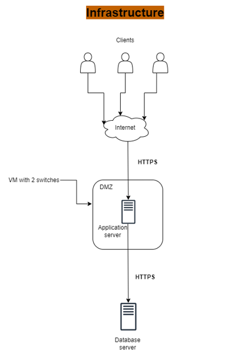
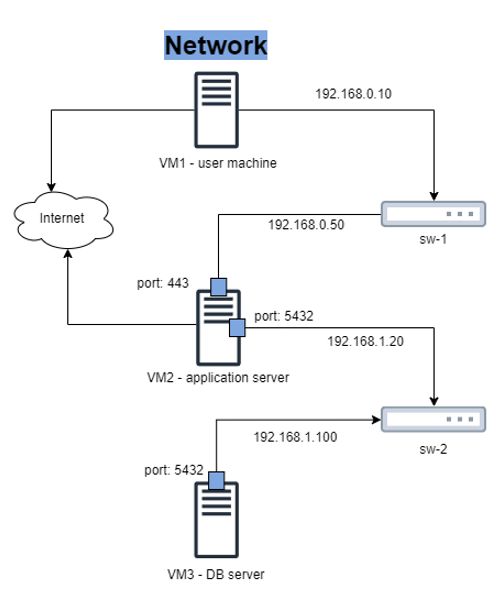
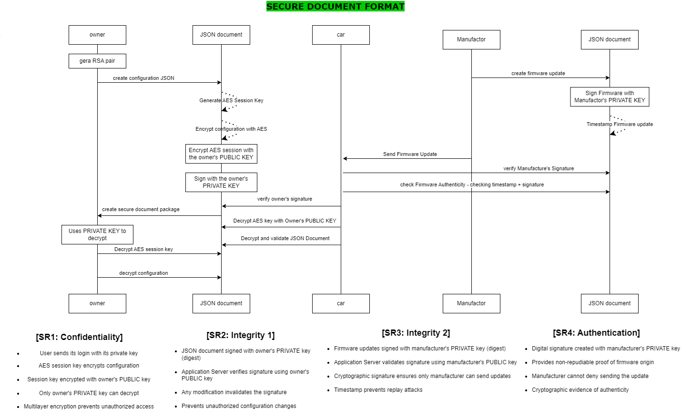
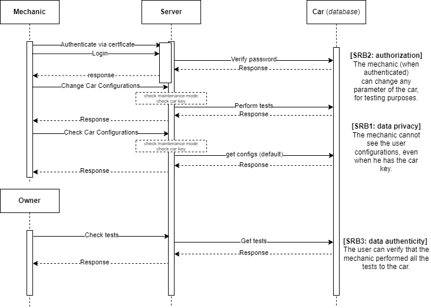

# T27 MotorIST Project Report

## 1. Introduction

This report describes the project developed within the scope of the Computer Security in Networks and Systems (SIRS) course. The project was carried out in the context of the fictional company MotorIST, which sells electric cars with modern management systems. The project is divided into three main parts: secure documentation, infrastructure and security challenge.

MotorIST is proud to lead the transformation in the automotive sector by introducing electric vehicles equipped with modern and innovative management systems. Our technology allows users to control and customize their vehicle remotely, providing unprecedented convenience. Through an application installed on their computer or mobile device, our customers can:
- Lock/unlock the car;
- Configure the air conditioning;
- Configure the seats positions;
- Check the battery level.

Additionally, to ensure our vehicles are always up to date, we offer firmware updates directly from the manufacturer, integrating constant improvements into the user experience.

We understand that security and privacy are crucial. All communications between the car and the user are protected with extreme care, ensuring data protection in accordance with the General Data Protection Regulation (GDPR).

Our system is designed to avoid interference from third parties:
- User Settings: Only the car owner can view or modify them.
- Firmware updates: Only the manufacturer can perform and authenticate these updates.
- Maintenance mode: This feature guarantees privacy and flexibility during technical support.
- Security Requirements

To protect our customers and ensure system integrity, we meet the following requirements:
- Vehicle Configuration
    - SR1: Confidentiality: Only the owner can access the car's settings.
    - SR2: Integrity 1: Settings can only be accepted if sent by the owner.
- Firmware Updates
    - SR3: Integrity 2: Only the manufacturer can send firmware updates.
    - SR4: Authentication: The manufacturer must ensure that updates are genuine and traceable.
- Maintenance Mode (About our **security challenge**)
    - Maintenance mode offers a default setting for technical testing, ensuring flexibility without compromising privacy:
        - SRB1: Data Privacy: The mechanic cannot access the user's settings, even though he has the car key.
        - SRB2: Authorization: Authenticated mechanics can modify parameters for testing.
        - SRB3: Data Authenticity: The owner can verify all tests carried out on the vehicle.


The data handled in transactions in MotorIST is car configurations that come in JSON format. To protect this documents a cryptographic library was developed.
The objective of the project is to guarantee the security of vehicle communications and configurations, using appropriate cryptographic techniques to protect documents and communications between servers.

The planned infrastructure has a set of separate (virtual) machines, with network isolation, namely: one database server; one application server, exposing an API; a client machine, to access the application server (Image of the infrastructure below).


<div style="display: flex; justify-content: space-around;">
  
  
</div>

The database implemented stores information about the users (owners, manufacturers and mechanics), the cars, the cars configurations, and some more information.

The application server accesses the database and performs CRUD operations (Create, Read, Update, Delete). These operations are made available to clients, by an application programming interface (API).

## 2. Project Development

### 2.1. Secure Document Format

#### 2.1.1. Design

(_Outline the design of your custom cryptographic library and the rationale behind your design choices, focusing on how it addresses the specific needs of your chosen business scenario._)
(_Include a complete example of your data format, with the designed protections._)


The custom cryptographic library, `cryptolib`, is designed to provide secure encryption and decryption functionalities tailored to the specific needs of our business scenario. The library aims to ensure data confidentiality, integrity, and authenticity, addressing the unique security requirements of our application.

The initial plan for the developed cryptographic library was to support various cryptographic operations and its use in the context of our scenario would be as follows:



Below is an explanation of our final implementation.

The library developed for the MotorIST project is designed to protect vehicle configuration documents. The main objective is to ensure data security, guaranteeing confidentiality, integrity and authentication. The main operations offered by the library are `protect()`, `check()`, `unprotect()` and `sign()`, described below:

- **`protect()`**: Adds security to a document by encrypting its contents to ensure that only authorized users can access it.This method uses symmetric encryption with AES to protect the document content and asymmetric encryption with RSA to protect the symmetric key used.
- **`check()`**: Checks the security of a document, ensuring that it has not been tampered with and is intact. It uses HMAC to check data integrity.
- **`unprotect()`**: Removes security from a document, decrypting its content for access and use. This method uses the corresponding private key to decrypt the symmetric key and then decrypts the document content.
- **`sign()`**: Adds a digital signature to a document, guaranteeing the authenticity and integrity of the document. It uses the sender's private key to generate the signature, which can be verified using the corresponding public key.

**Safety Requirements Met:**

- **Confidentiality**: Only authorized users can access the content of the documents. 
- **Integrity**: Guarantee that documents have not been improperly altered.
- **Authentication**: Verification that documents are only accessed by authorized users.
- **Digital Signature**: Guarantee that the sender of the document is authentic and that the document has not been altered.

The custom cryptographic library was designed taking into account the security requirements required for the chosen business scenario. Thinking a little about what it would be like in real life, every car has its key, in the context of our project this will be the car.key a symmetrical key, we assume that its sharing is done as if it were the real car key (by hand) or Let us assume that if the user (owner and/or mechanic) can see the settings it is because they have the key. We also use this symmetric key to guarantee the confidentiality of the settings since only the car owner has it and the mechanic if the owner gives him the key. This implied that the settings only exist in the database encrypted with the car key, so if an attacker tries to view the car's settings he will not be able to as he does not have the symmetric key to decrypt them.

This cryptographic library created also allows the signing of documents to guarantee Authentication of, for example, The car manufacture cannot deny having sent firmware updates, this signature being verified using the check() command.

**Design choices and justification when it comes to cryptographic algorithms**: 
To ensure what has already been explained previously, here is a more detailed explanation of our choices regarding cryptographic algorithms and the justification of the choice taking into account the overall nature of the algorithm and what is applicable to our scenario:

- *Symmetric Encryption*:
    - Algorithm: AES (Advanced Encryption Standard) (`AES/CBC/PKCS5Padding`).
    - Rationale: The choice of the symmetric encryption algorithm with `AES/CBC` was due to its wide use due to its efficiency, speed and robust security. Since it is ideal for protecting large volumes of data in transit or at rest, in the case of our project this key protects all car configurations in transit and in the Database (at rest). By using a single key, its implementation is simpler, making it a practical choice in trust scenarios where secure key exchange is possible, as already explained, this symmetric key represents the real car key, i.e. we assume that the exchange is made by hand, meaning changing the key is safe. AES is also resistant to known attacks and widely compatible, making it a trusted and recognized standard.
- *Asymmetric Encryption*:
    - Algorithm: RSA.
    - Rationale: Asymmetric encryption with RSA is used in this code for secure key exchange and protection of sensitive data in untrusted environments. It allows a public key to be freely shared to encrypt data, while only the corresponding private key can decrypt it. Additionally, RSA supports authentication and data integrity through digital signatures. With 2048-bit keys, it guarantees robustness against known attacks. It is widely adopted and often used in conjunction with symmetric algorithms like AES for greater efficiency and security. In the case of our project, the use of this algorithm is more for protecting the symmetric key itself and for signing documents.
- *Key Management*:
    - Key Derivation: RSA with KeyStore (PKCS12 format).
    - Rationale: Key management is essential to ensure security in asymmetric encryption. The code uses KeyStore to securely store and extract private keys from P12 files, ensuring controlled access. Furthermore, it allows the generation of RSA key pairs with high security (2048 bits). Using Base64 for encoding makes storing and transmitting keys easier. This process is essential to maintain the confidentiality and integrity of cryptographic operations.
- *Digital Signatures*:
    - Algorithm: SHA256 with RSA.
    - Rationale: Digital signature with SHA256 and RSA guarantees the authenticity and integrity of the JSON, ensuring that only the private key holder can create the signature. Using a hash (SHA256) makes the process efficient, reducing the data processed. RSA adds robustness against attacks, while method compatibility allows for easy verification with the public key. It is a reliable and secure solution for protecting confidential data.
- *Data Integrity*:
    - Algorithm: HMAC (Hash-based Message Authentication Code) with SHA-256.
    - Rationale: HMAC with HmacSHA256 ensures integrity and authentication by verifying that data has not been altered and is from a trusted source. Using a private key to generate the HMAC and the public to verify it, it combines high security with processing efficiency. It is resistant to collisions and brute force attacks, making it ideal for protecting sensitive messages or data. Its simplicity and compatibility make it a reliable choice for quick scans.

CryptoLib is designed to meet the specific security needs of our business scenario by providing robust encryption, authentication, and key management mechanisms. The library ensures that sensitive data is protected at all times, mitigating the risk of unauthorized access and data breaches.

#### 2.1.2. Implementation

(_Detail the implementation process, including the programming language and cryptographic libraries used._)
(_Include challenges faced and how they were overcome._)

The cryptographic library was implemented in Java and, as requested, the cryptographic library can be (or is) used in 2 ways:
 - Integrated into the project's API, mainly used by the `message` class, responsible for everything when it comes to messages exchanged between machines;
 - Through the terminal with a cli interface

The cryptographic library suport the following commands:
- **Protect** - Protects a JSON file, using the provided secret key to encrypt with AES, and the private key to encrypted the secret key and also provide Integrity. The results are written to the provided path. It is also possible to use this command just to protect with the asymmetric key, the idea and objective of this function was to allow the 2nd encryption step to be carried out for data that is already encrypted, the idea thought and presented to the pratical teacher was that the car's settings should exist in the database always encrypted with the secret key. Once this data was "transported" it would only be necessary to perform this 2nd step.

    Use:
    ```shell
        cryptolib protect <path-to-json> <path-to-secret-key> <path-to-private-key> <path-to-write-results> <filename>
    ```
    or
    ```shell
        cryptolib protect <path-to-json> <path-to-private-key> <path-to-write-results> <filename>
    ```

    Where:
    - `<path-to-json>`: Path to the JSON file.
    - `<path-to-secret-key>`: Path to the symmetric key
    - `<path-to-private-key>`: Path to the private key used for ecryption.
    - `<path-to-write-results>`: Path where the results will be saved.
    - `<filename>`: Output file name.

- **Unprotect** - This command is used to unprotect documents that were secured with symmetric (AES) and asymmetric (RSA) encryption. Unprotects the provided encrypted JSON file, using the asymmetric key to decrypt the secret and this one to decrypt the settings. The decrypted file is written to the provided path. This command is used to "unprotect" a document, returning its original content. Can be used in two modes, to match the 2 encryption modes of the protect command:
    - **Mode 1**: Unprotects a document that was protected with only asymmetric encryption (RSA).
    - **Mode 2**: Unprotects a document that was protected with both symmetric (AES) and asymmetric (RSA) encryption.

    Use:

    ```shell
        cryptolib unprotect <path-to-protected-json> <path-to-private-key> <path-to-write-results> <filename> <1|2>
    ```

    Where:
    - `<path-to-protected-json>`: Path to the protected JSON file.
    - `<path-to-private-key>`: Path to the private key used for decryption.
    - `<path-to-write-results>`: Path where the results will be saved.
    - `<filename>`: Output file name.
    - The value `1` or `2` indicates the desired decryption mode.

- **Sign** - The sign command is used to digitally sign a JSON file. It receives as input the path to the JSON file, the P12 file that contains the private key, the password to access the key, and the output path where the signed file will be saved. The command generates a digital signature using the private key (in RSA format) and adds it to the JSON content, guaranteeing the authenticity and integrity of the file. The signed file is then saved to the specified path.

    Use:
    ```shell
        cryptolib sign <path-to-json> <path-to-p12> <password> <output-path>
    ```

    Where:
    - `<path-to-json>`: Path to the JSON file to be sign.
    - `<path-to-p12>`: Path to the P12 file that contains the private key.
    - `<output-path>`: Path where the results will be saved.

- **check** - The check command is used to check the validity of the digital signature of a JSON file. It takes as input the JSON file path and the public key path corresponding to the private key that was used to sign the document. The command checks whether the JSON signature is valid, using the public key and the SHA256 algorithm with RSA. The verification result (true or false) is displayed in the terminal, indicating whether the JSON file was signed correctly.

    Use:
    ```shell
        cryptolib check <path-to-json> <path-to-public-key>
    ```

    Where:
    - `<path-to-json>`: Path to the JSON file to be sign.
    - `<path-to-public-key>`: path to the public key corresponding to the private key that was used to sign the document.

Additionally, there is a **help** command that can be invoked in the terminal and presents instructions on how to use each command explained. This help command is invoked when cryptolib is sent without arguments or when it is called directly with the help command.

Use:
```shell
    cryptolib help
```
or
```shell
    cryptolib 
```


***Cryptographic Libraries used***
- `java.security`: utilized for cryptographic operations in the provided Java code. It includes key handling with java.security.PrivateKey and javax.crypto.SecretKey, along with key-related operations using KeyFactory and specifications like SecretKeySpec. Digital signatures are created through java.security.Signature with the private key. (other functions from this library were used)
- `javax.crypto`: The package is employed for cryptographic functionalities in the Java code. It involves encryption and decryption operations through the javax.crypto.Cipher class. Different cryptographic algorithms and modes are specified. Initialization vectors (IVs) are managed using javax.crypto.spec.IvParameterSpec, and secret keys are constructed with javax.crypto.spec.SecretKeySpec. 
- `java.util.Base64`: class in the provided Java code is used for encoding and decoding binary data to and from Base64 representation. It facilitates the conversion of byte arrays to Base64 strings and vice versa. This functionality is applied in encrypting/decrypting the content, creating digital signatures, and encoding/decoding keys, ensuring safe representation in text-based formats like JSON.
            
### 2.2. Infrastructure

#### 2.2.1. Network and Machine Setup

(_Provide a brief description of the built infrastructure._)
(_Justify the choice of technologies for each server._)

The built infrastructure includes a database server, an application server that exposes an API, and a client machine to access the application server. Each machine has been configured to ensure communications security and network isolation.

To configure the Network and setup the machines, the available and appropriate tutorials must be followed. The init_machine.sh scripts also allow automation of almost all network configuration

The network infrastructure consists of 3 separate (virtual) machines with network isolation, including:
 - One database server: Store all data necessary for the application to function.
 - One application server: It has an API and redirects the request to the database.
 - A client machine: Accesses the application server via terminal.

*Client Machine* ([Machine 1](init-machine1.sh)):

The client machine connects to the application server through the terminal using a simple command-line interface to make requests. According to the type of user who logged in, the actions they can perform appear. This verification is done through the certificate that the client machine sends to the server, then the server gives you only the actions it can do. We prevent, for example, a logged-in manufacturer from carrying out actions that are not allowed for the type of user he is, that is, instead of checking action by action whether the user can perform, we restrict which actions he can choose.

*Application Server* ([Machine 2](init-machine2.sh)):

The application server communicates with the client receiving requests and comunicates also with the data base sending request and reply to the client with the response received from the database. The communication channel is secured using SSL/TLS configurations to ensure data integrity and confidentiality.

*Database Server* ([Machine 3](init-machine3.sh)):

The database server is designed to store encrypted information securely. 

The choice of technologies for each server ensures optimal performance and security, with the database server being fully protected within a private network.

All the code is implemented in Java using some libraries specialized in cryptography, security, secure communication and so on. We chose to implement it in Java because it was the language used in laboratory classes, meaning we were able to reuse code or at least the logic and structure.

When it comes to database, we use PostgresSQL since we have already used it in other areas and feel more comfortable performing operations and setup


#### 2.2.2. Server Communication Security

(_Discuss how server communications were secured, including the secure channel solutions implemented and any challenges encountered._)
(_Explain what keys exist at the start and how are they distributed?_)

Communications between servers were secured using TLS to ensure the confidentiality and integrity of data in transit. Cryptographic keys were generated and distributed in a documented and secure manner, ensuring that only authorized entities could access and modify vehicle configurations.

In this project, all communications were secured using the Transport Layer Security (TLS) protocol, ensuring confidentiality, integrity, and authentication.

- TLS provides secure communication over networks by:
    - Confidentiality: Encrypting data to prevent unauthorized access.
    - Integrity: Ensuring data remains unaltered during transit via Message Authentication Codes (MACs).
    - Authentication: Verifying server identity using certificates issued by trusted Certificate Authorities (CAs).

- Key Implementation Details:
    - TLS Version: The latest version, TLS 1.3, was used for enhanced security and efficiency.
    - Cipher Suites: Modern suites like AES for encryption and SHA-256 for authentication ensured robust security.
    - Certificates: X.509 certificates were deployed for server authentication, with secure storage of private keys.

- Secure Channel Establishment - The TLS handshake established encrypted channels:
    - The client initiated the handshake, listing supported versions and cipher suites.
    - The server selected configurations and sent its certificate for client verification.
    - Key exchange created shared session keys without transmitting sensitive information.
    - Encrypted communication began using session keys.

- Enhanced Security: Protection against attacks like man-in-the-middle (MITM) or Replay-Attacks.

All keys and certificates are stored in the [KeysAndCrt](KeysAndCrt/) folder.
Existing keys:
 - Symmetrical key ([Car Key](KeysAndCrt/CarsKey)) - this key symbolizes the real car key and in the real world it would not be stored on any user's device and when it comes to its distribution we assume for this project that it is delivered by hand and the only users to have access are the car owner and the mechanic when the owner gives it to him, i.e. this key only exists on the client's machine.
- Asymmetric key - each type of user has to be a pair of asymmetric keys to sign documents and so on. Each person's private key is stored in a keystore in a p12 file, so the private key only exists on the client side (in the real world on the given user's device, since we use the same machine for all types of clients, the client machine has all these keys stored) none of the other machines have access.

For testing/evaluation and demonstration purposes only, there is a file with all users' login passwords ([password file](KeysAndCrt/pass.txt)), as is obvious in reality, in a real application, each user would know their password and it would not be stored anywhere, let alone in the secure storage offered.

### 2.3. Security Challenge

#### 2.3.1. Challenge Overview

(_Describe the new requirements introduced in the security challenge and how they impacted your original design._)

Our group chose *Security challange B*. This introduces the concept of maintenance mode, which can only be activated by the car owner and allows the mechanic to test the car's settings without ever changing or viewing them. When this mode is active, even with the key, no user (owner and mechanic) can see the current car configurations, these settings are set by the user, in this mode all users can only see the default car configurations.

This process of only seeing the default car configurations is handled with a check on the server that first obtains the mode status and accordingly makes a different request to the database in one case obtaining the current configuration in another case obtaining the default.

The same type of verification and guidance is done with the settings sent by the mechanic, the mode is checked and if so, the tests are then accepted.

The last requirement of the security challenge is to ensure that The user can verify that the mechanic performed all the tests to the car, this is guaranteed by the owner having the option of listing the tests carried out and these being signed by the mechanic who performed them

#### 2.3.2. Attacker Model

(_Define who is fully trusted, partially trusted, or untrusted._)
(_Define how powerful the attacker is, with capabilities and limitations, i.e., what can he do and what he cannot do_)

The *database server* is considered completely trustworthy, it is protected by a firewall on our private network and sensitive data such as password and settings are fully encrypted.

The *application server* is considered only partially trusted. This one is in a DMZ because it is connected to the Internet and exposed to DMZ exploitation by an attacker outside our network.

The *client application* is considered untrustworthy because it connects over the Internet, i.e. its communication comes from external networks, which introduces a higher level of exposure to potential security threats and unauthorized access. There is a server trust store that contains client certificates to authenticate them, if an attacker manages to get the application server to trust it, or obtains the certificate of a trusted user they will not be able to make access requests without the private password of the user in question. This component is protected by a login that requires a user id and a password that only the user knows and a certificate also protected with a password. To facilitate implementation, this password is the same but in a real application it would have to be different to increase the security and reliability of the client application.

An attacker can never impersonate another user without having their password and a trusted certificate. Without obtaining the secret (symmetric) key, which is not an easy task, as it only exists on the client side, its transmission is by hand and is created using the CBC mode which prevents the perception of patterns in the encryption, an attacker cannot view any configuration even if he manages to obtain it.

If a malicious hacker gains access to the victim's computer and can access the victim's file system, he will have access to the settings viewed by the victim. We understand this is a vulnerability and plan to fix it by having the customer store the settings in encrypted form and at the same time store the symmetric key to decrypt them in their secure key store;

#### 2.3.3. Solution Design and Implementation

(_Explain how your team redesigned and extended the solution to meet the security challenge, including key distribution and other security measures._)
(_Identify communication entities and the messages they exchange with a UML sequence or collaboration diagram._)  

The entire application design process has already taken into account the chosen security challenge, meaning we did not have to adapt or rethink our design, this process was taken into account from the beginning.

It was soon thought about incorporating an attribute into the car's info that would be a boolean value referring to the activation of this mode, and that all operations related to or influenced by this mode would undergo an additional check so that the server would know what request to make to the database.

For our challenge it was not necessary to think of another way to distribute the keys because each user has their own private one and the server has information about the public one so that it is possible to verify the user's identity, and the symmetric key exists only on the owner's side or when passed by hand on the mechanic's side, i.e. there are no problems or lack of security in distributing the keys.

This security challenge has brought greater attention to the actions that a mechanic can perform and how to prove that it was the mechanic who performed the actions, namely the user (owner) can verify that the mechanic performed all the tests to the car, i.e., it involved that the tests were signed with the private key by the mechanic so that the user can ask the server to verify that it was really the certified mechanic who prepared/executed the tests.

Sequence diagram:




## 3. Conclusion

(_State the main achievements of your work._)
(_Describe which requirements were satisfied, partially satisfied, or not satisfied; with a brief justification for each one._)
(_Identify possible enhancements in the future._)
(_Offer a concluding statement, emphasizing the value of the project experience._)

Throughout the development of the MotorIST project, our team successfully designed and implemented a custom cryptographic library adapted to the specific needs of our business scenario. We establish a secure infrastructure, ensuring robust security in server communication. Furthermore, we effectively addressed the new requirements introduced by the security challenge by adapting our original design to improve key distribution and overall security measures.

Our main achievements include:
 - Design a custom cryptographic library that meets the security needs of your enterprise scenario.
 - Implement a secure infrastructure using technologies appropriate to each server.
 - Securing server communications.
 - Successfully adapting our design to meet the requirements of the security challenge.

Although we met most of the project requirements, some were partially met due to time constraints and technical challenges. These areas provide opportunities for future improvements, such as optimizing key distribution methods and further strengthening security protocols.
Also, the initial suggestion for communication using the JSON document got a bit lost during the implementation of the project, since we began implementing a class Message that would store the information of the messages being exchanged and ended up using objects of that class for the communication.

For future work that is more similar to reality, we should allow the existence of more than one user who could have 1 or more cars, always ensuring the security of all configurations and respecting the GDPR and not allowing one user to access another's car.

The practical classes helped us to have a code base for the cryptographic library, helped us with the setup of the machines and in the construction of all secure communication via sockets

In conclusion, this project was a valuable experience, providing us with practical knowledge about cryptographic design and secure infrastructure implementation. The challenges faced and overcome have enriched our understanding and capabilities in cybersecurity, preparing us for future work in this field. This project allowed us to apply all the elements learned in theoretical classes and gave the possibility of applying this communications security to real-world applications.


## 4. Bibliography

- [Security Stack Exchange](https://security.stackexchange.com/)
- [Chatgpt](https://chatgpt.com/)
- [Encryption and Decryption in Java](https://medium.com/@sharadblog/encryption-and-decryption-in-java-60948b8a3613)
- [TLS](https://www.cloudflare.com/learning/ssl/why-use-tls-1.3/)
- [StackOverflow](https://stackoverflow.com/)
----
END OF REPORT
