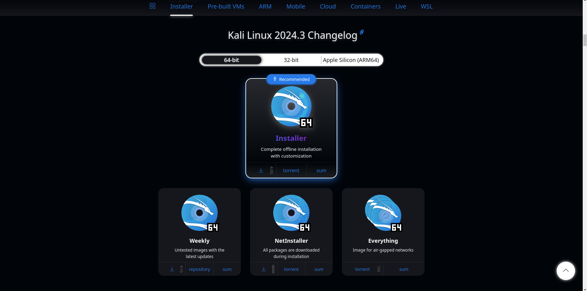

# Virtual Machine Download Tutorial

* Download VirtualBox from their website [VirtualBox](https://www.virtualbox.org/)

* Download the latest Kali iso image (available on their website [Kali](https://www.kali.org/get-kali/#kali-installer-images)):

* Now procede to the [Installation](vm_install_tutorial.md) tutorial