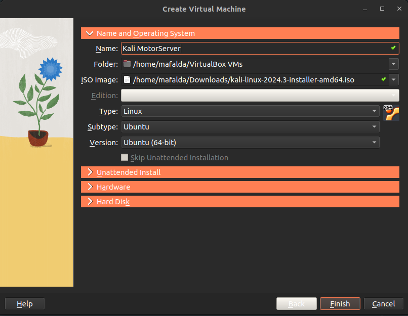
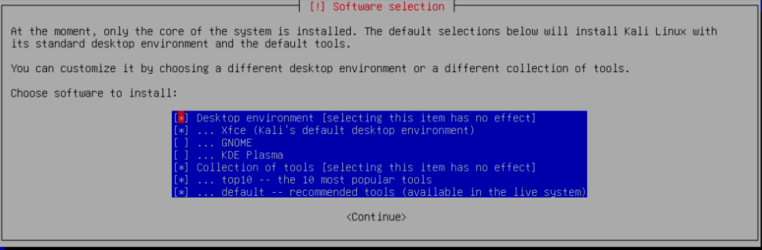
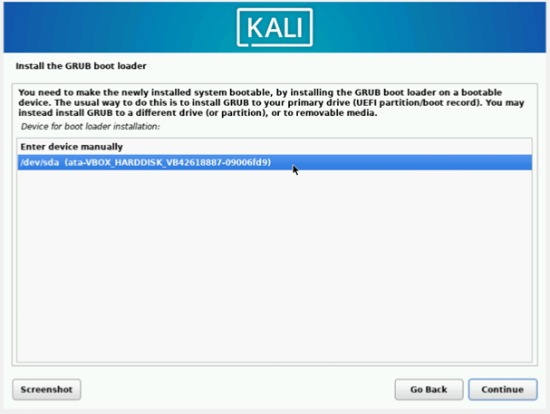

# Virtual Machine Installation Tutorial

* Open Virtual Box

* Click `New` to create a new virtual machine

* In the `ISO Image` box select the iso you just downloaded:

* Click `Finish`

* Click `Start` to start the machine and choose `Graphic Install`

* Complete the configuration steps with your preferences:

1. When asked about the `Hostname` leave the default name

2. Skip the `Domain name` phase

3. You can define the `username` and `password` as "kali" 

4. Set the `timezone` to "Lisbon"

5. In the `Partition Disks` select "Guided - use entire disk" and then choose the only option that appears

6. Select "All files in one partition"

7. Select "Finish partitioning" and select "Yes" to write changes to disk

8. Choose the following options for the desktop environment (they chould appear selected by default):

9. Wait for about 10 minutes to finish the installation

10. Install the GRUB boot loader when asked to and then click on:

11. Click `Continue` to complete the installation

12. After that the machine will restart and you should be able to login using the username and password defined previously (don't start the machine yet, follow the next steps first)